# Performance

## 1.SSD mAP
| architecture |train data| VOC07 | VOC12 | COCO with Iou=0.5(only coco train ) | 
| ---- | ---- | ---- | ----- | -------|
| Faster | VOC07_train | 69.9| - |- |
|        | VOC07+12   | 73.2| 70.4|-|
|        | 07+12+coco| 78.8| 75.9 | 45.3|
| Yolov1 | 07+12     | - | 57.9|
| SSD300 | VOC07_train | 68.0| - |-|
|        | VOC07+12   | 74.3| 72.4 |-|
|        | 07+12+coco| __79.6__| 77.5|41.2|
| SSD512 | VOC07_train | 71.6|  -|-|
|        | VOC07+12   | 76.8| 74.9|-|
|        | 07+12+coco| __81.6__|__80.0__|__46.5__|

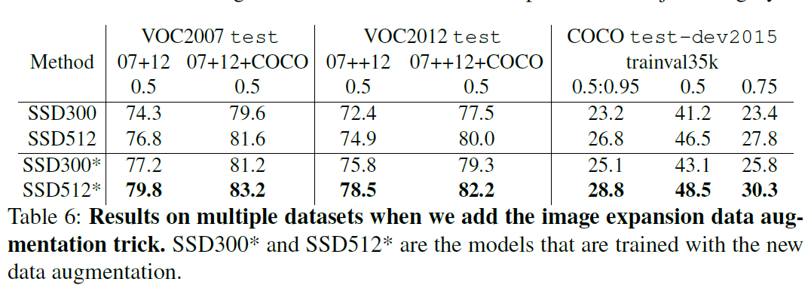
* Todo List
- [ ] SSD+channel pruning
- [ ] SSD+FPN
- [ ] SSD+Focal loss
- [ ] SSD+C.Relu 
## 2. MobileNet_V1
| architecture |ImageNet Accuracy| Million Mult-Adds | Million Parameters  |
| ---- | ---- | ---- | ----- |
| MobileNet_V1 | 70.6% | 569  | 4.2 |

* Todo List
- [ ] Mobilev1 + ResNet
- [ ] Mobilev1 + ResNeXt 

## 3. MobileNet_V2
* Imagenet Accuracy

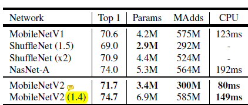

* COCO MAP

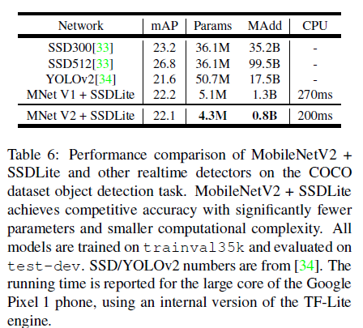

* Todo List

## 4. R-FCN
| architecture |train data| VOC07 | VOC12 | COCO with Iou=0.5(val/test ) |  inference time (s)|
| ----         | ----     | ----  | ----- | -------       |   -  |
| RFCN         |   k=3    | 75.5  |   -   |   -           | 0.17 |
| (with atrous)|   k=7    | 76.6  |   -   |   -           | 0.17 |
| (with OHEM)  |  300 RoI | 79.5  |   -   |     -         | 0.17 |
| (multi_sc train)|07+12  | 80.5  |   -   |     _         | 0.17 |
|(multi-sc train)|07+12+coco|__83.6__ |   -   |     -         | 0.17 |
|Faster RCNN+++|  coco trainval | -  | -  |  test-55.7    | 3.36 |
| R-FCN multi-sc | coco train | - | -     |  val-49.1     | 0.17 |
| R-FCN multi-sc train,test| coco trainval |-|-| test-__53.2__| 1.00 |

* Todo List
- [ ] I should think something to do
- [ ] Reading Deformable Conv(Deformable convolutional networks. arXiv preprint arXiv:1703.06211, 2017)

## 5. SE-net
* SE + ResNet performance（imagenet） :
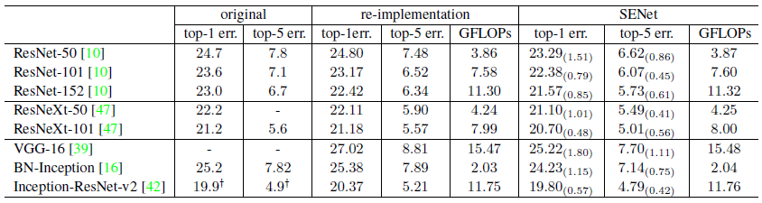
* SE + MobileNet Performance （imagenet）:
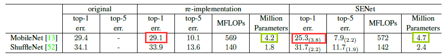
精度有明显的提升，从计算量来看速度应该都差不多
* SE + ResNet（COCO）：

    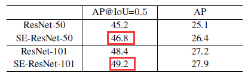
* Todo List
- [ ] Maybe Change __Avg Global Pool__ into __Separable Conv Layer__ (such 7x7),original paper implement Mobile .but it don`t my idea. 
- [ ] Maybe Change __ResNet archit__ into __MobileV2__ (c-> 6*c ->c)
- [ ] 优化 _global pooling layer_ 和 _small inner-product layer_

## 6. PVA-Net

* ImageNet2012

    | Model |top-1 | top5 | Cost(GMAC) |
    | ----  | ---- | ---- |--------|
    | VGG-16| 28.07| 9.33 | 15.3   |
    |GoogleNet| -  | 9.15 | 1.5    |
    | ResNet-152| 21.43 | 5.71 |11.3|
    | ----  | ---- | ---- |--------|
    |PVANET | 27.66 | 8.84 | 0.6  |
* VOC07-test(Proposals=200)
    | Model |Recall(%) | mAP(%) | FPS |
    |-------|---------|------|----|
    |PVANET| 98.8 | 84.4| 23.7|
    |PVANET+vote|98.8|__84.9__|21.7|
    |PVANET+vote+compressed|98.8|84.4|   __31.3__|

* VOC12-test()
    | Model |Total Cost (GMAC) | Runing time(ms)| mAP(%)|
    |-|-|-|-|
    |PVANet+vote| 27.8| 46 | __84.2__ |
    |PVANET+compressed|__12.5__|32|83.7|
    |Faster RCNN+ResNet-101| >206.4|2240|83.8|
    |Faster RCNN+VGG-16| 204.4| 110 | 75.9|
    | RFCN + ResNet-101| 122.9|133|82|
    |SSD512(VGG16)| 86.7 |__53__ |82.2|

* Todo List

- [ ] rfcn + pva(rpn部分减少计算)，用rfcn替换roi pool
- [*] svd + pva(fc)
- [*] pva 去掉bn：  conv-bn  --》 conv

## 7. Refine-Det

* PASCAL VOC 2007

    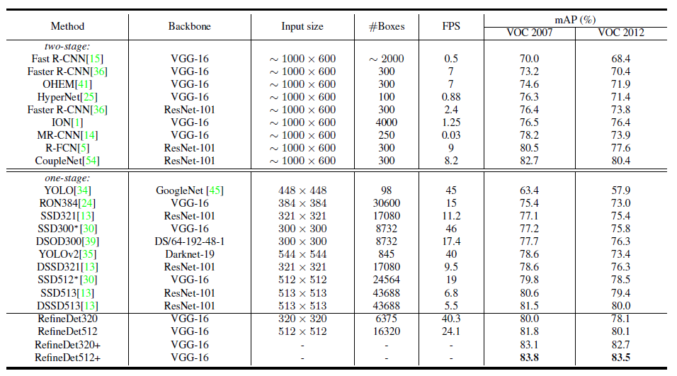

* MS COCO

    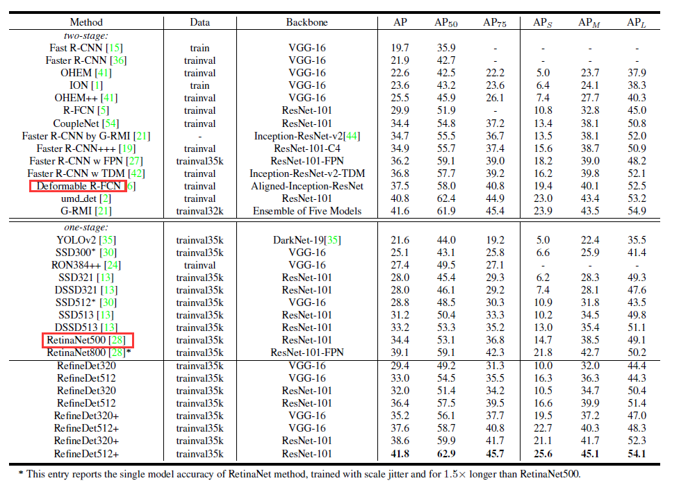

* Todo List：

    类似于FPN，需要看paper：An Analysis of Scale Invariance in Object Detection－SNIP

## 8. Light-Head RCNN
* Result

    |  Model  | COCO mAP |  Speed(fps) |
    | ------- | -------- | ----------- |
    | Xeception-light-head RCNN | 30.7 |  __102__|
    | ResNet-101-light-head RCNN | __41.5__| - |

* COCO test-dev
    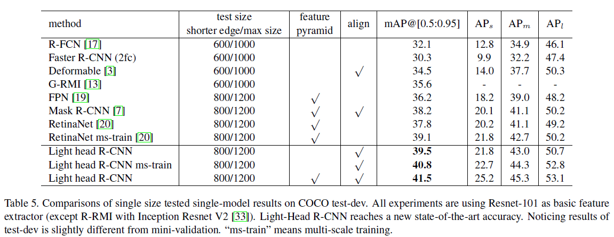

* ImageNet  Xeception-like architecture
    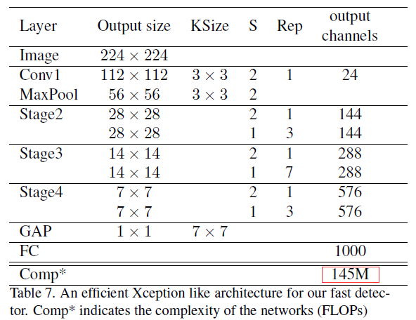

* COCO Speed

    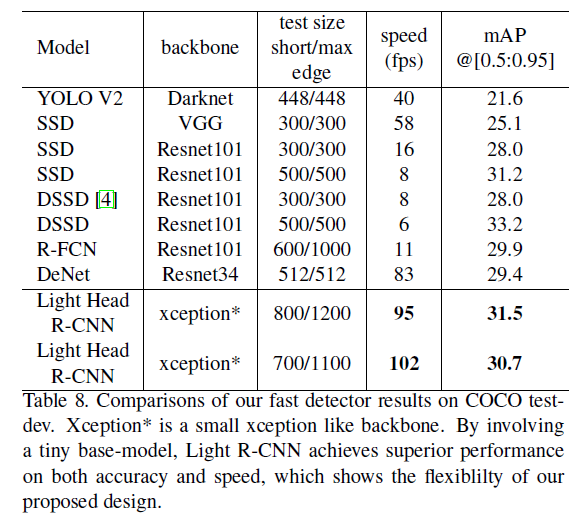

* Todo List:
    - [ ] basebone由ResNet-101 换成了Xception，在COCO上达到了30+的mAP，速度是102fps。
    - [ ] basebone 由ResNet-101 换成 pvanet？
    - [ ] basebone 由ResNet-101 换成 mobileV1-v2？

## 9. Mask RCNN 

* COCO detection：

    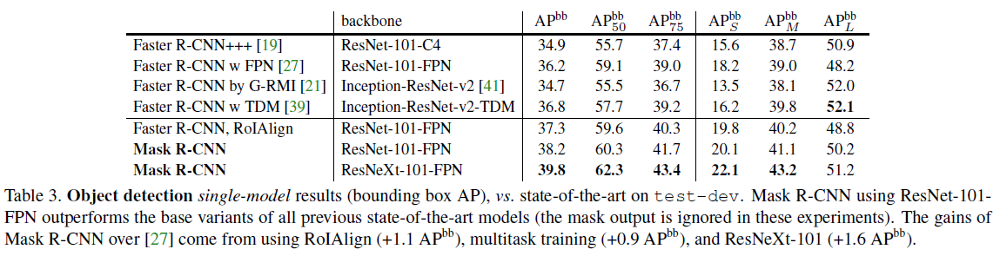

* Instance Segmentation：

    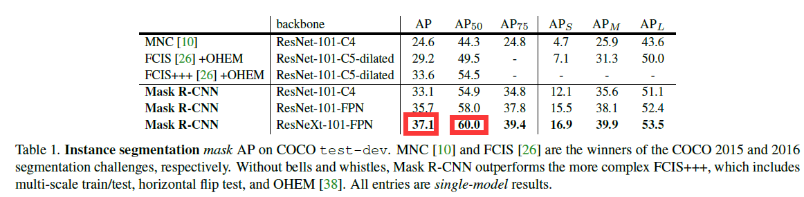

* The impact of ROIAlign:

    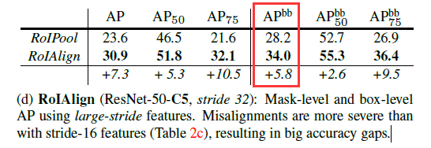