# PaperNotes4DL
 This is markdown file and follow Deeplearning papers

# Attention

# Classification

# Object Detection
  
  This folder contains:
  ## 1. SSD
    Main work:
* One Stage的检测算法。在不同尺度上的feature map 生成不同面积和长宽比的multi-boxes。比如在conv4_3((_38*38_) 上生成4个boxes：长宽比为 {2，1/2}，面积比为{1， sqrt(skxsk-1)}
* 每个 anchor 输出的维度数是 __num_classes + 4__ , 4 means (centreX,centreY, width, height), 因此feature map上 每个cell有 _k_ 个 anchor 输出就是 k*(num_classes + 4) .
* 总的loss等于 分类的softmax loss + 回归的 smooth L1 loss
* 生成的anchor的面积由 S _k_ 决定 公式如下：
    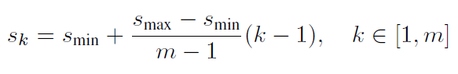

    在论文中 Smin=0.2， Smax=0.9 ，PriorBox 层中每一层都由一个smin和smax需要设置，根据理解，这是anchor的最小尺寸，即SSD可以检测出最小物体的尺寸为0.2*300（image_width）=60 pixels
* SSD 在训练中保持正负样本比为1：3 。其中正样本是anchor与GT的IOU大于阈值的，负样本是IOU小于阈值的。
* 在SSD中训练的类别数等于 要识别的类别数+1 ，比如voc是20，则num_classes=20+1=21. 第0类是背景类
    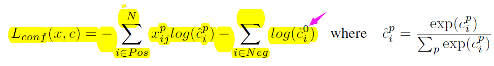

* 数据增强部分，除了使用传统的crop，旋转，还是resize，将原图放大或者缩小，其他的地方补0.
* 使用了孔洞卷积(atrous)  通过修改conv layer中的dilate参数实现。扩大的kernel size=dilate*(k_size-1) + 1 使用孔洞卷积 或者stride=2 来代替pool进行downsample。

 ## 2. MobileNetv1
 * 提出了一种适用于移动端的网路结构，separable convolutions. 它是由3x3的 separable *convolution 后面接一个1x1的pointwise卷积构成。
 * separable convolution的概念就是一个Filter只处理一个channel。与正常的卷积一个Filter要处理所有的channel相比，计算量大致变为原来的1/(K_size * K_size) 。如果k_size=3，则计算量约为原来的1/8~1/9
 * separable conv与standard conv的计算量比较：

    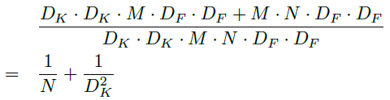

* 在训练的过程中，使用了《Knowledge Distilling》 来提高mobileV1的精度。
* 下采用都使用的stride=2 而不是pooling layer。  
* standard conv与mobileV1的结构比较：

    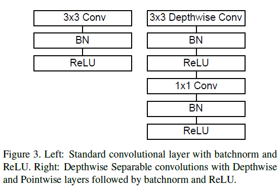 
*  separable conv 需要采用较小的weight decay （L2 norm）甚至不需要regularization ，它的时间消耗97%来源于1x1 的pointwise。
* 在人脸的网络了， 测试了FaceNet.

## 3. MobileNetv2
* 主要的两个工作：1）反残差结构，2）线性的bottleNeck，最后一个1x1的conv不加relu
* input （N，H，W，C）首先通过一个1x1的conv 来增加channel（N,H,W,t*C），然后再经过 3x3 的separable conv ，最后再通过1x1的conv 减少channel（N，H，W，C）。
* 主要网络架构：

    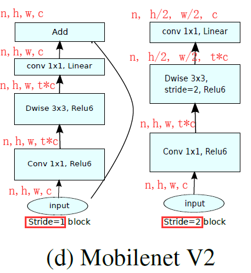

* 网络中的激活函数都使用的relu6
* SSD Lite 是将SSD中所有的预测层都改成mobilev1的版本
* 通过扩大输入尺寸来提高模型的性能，MobileNetV2（1.4） 模型的性能最高其输入的分辨率为224的1.4倍。

- [*] MobileNet + ResNeXt

## 4. R-FCN
* 提供Roi pooling层是有悖自然规律的，这个paper中使用Roi-wise subnetwork来代替Roi-pool

* rfcn 使用position-sensitive 层来代替faster中的 ROI pooling。 在卷积层后面输出的是k^2（C+1） 个channel的 feature map， k是roi的spatial grid， C是分类的类别数。
* 他实验中使用的backbone是ResNet-101
* 训练中使用OHEM来训练。
* R-FCN的输入尺寸 被resize了，最短边resize到600， 每个GPU 一张图，选择128个ROI来反向传播。
* 使用了 _atrous conv_ （使用孔洞卷积）提升了2.6个mapl
* 在R-FCN中,ResNet-101（basebone）的conv5层的stride=2 改为stride=1，来增大feature map的尺度。 conv5层中所有的卷积层都改成空洞卷积（atrous）,修改前后的对比结果：
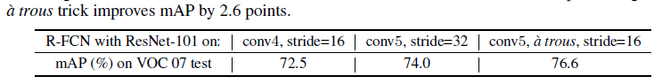
* R-FCN 也是把ROI区域分成kxk个区域，但是每一块对应一个channel。实现表明，k越大准确率越高。实验中k=7的时候准确率最高，但是channel的数量也会很大。
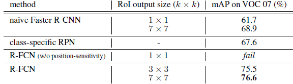
* 训练的时候输入尺寸从{400，500，600，700，800}随机采样，但是测试的时候固定为600
* 训练COCO的时候使用80k的train，40k的val和20k的test。前90k iter的学习率为1e-3，后30k iter 的学习率为1e-4.
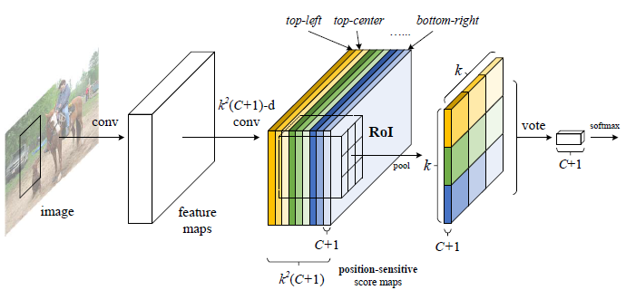

## 5. SE-Net
* SE-net 专注于channel之间的关系，SE略微的增加了计算量和网络复杂度，但是inference time几乎不变，精度有提升。
* 浅层的特征是类别无关的， 深层的特征是类别相关的。
* 使用attention和gating(eg. softmax and sigmoid)的机制被应用于图像理解（_Spatial transformer networks_， NIPS2015）图像定位（_Capturing top-down visual attention with feedback convolutional neural networks_，ICCV2015），和序列模型（_Joint line segmentation and transcription for endtoend handwritten paragraph recognition_. NIPS20160）（_Learnable pooling with context gating for video classification_. arxiv2017）
* image caption(_SCA-CNN: Spatial and channel-wise attention in convolutional networks for image captioning_, CVPR2017)(_Show, attend and tell: Neural image caption generation with visual attention_, 2015) and lip reading(_Lip reading sentences in the wild_, CVPR 2017)   
* attention 机制(_Stacked hourglass networks for human pose estimation_, ECCV2016)(_Residual attention network for image classification_ ,CVPR2017)
* Squeeze ： global average pool or other 复杂的聚合方法（如 separable conv）
* Excitation：FC(1x1xC/r) -> relu -> FC(1x1xC) -> sigmoid
* SE - Inception Module

    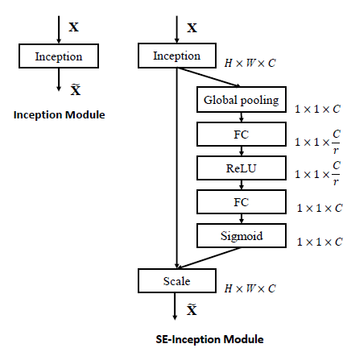
* SE - ResNet Module

    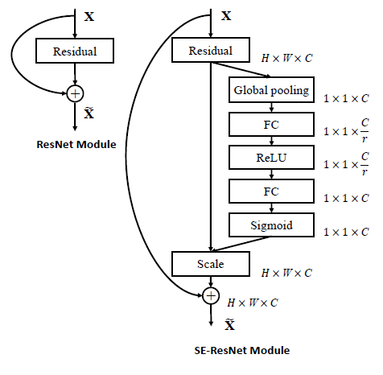

* ResNet-50的 forward 和 backward 加一起 190ms， SE-ResNet-50 的total time是209ms。导致实际时间比理论时间要慢的原因是global pooling layer和 small inner-product layer 没有优化。

* 实验中所有的r=16 ， 实验中使用的权重初始化方法为（_Delving deep into rectifiers:Surpassing human-level performance on ImageNet classification_，ICCV2015）

* 最后提交的SE-Net是SE-ResNeXt(64x4d)-154

* 场景分类数据集 - Places-365

## 6. PVA-Net

* 这个又细又深的网络可以使用BN来训练。

*  总的设计原则： 层数多，但每一层的channel数比较少； 在网络的前几层使用 __C.Relu__ （_Understanding and improving convolutional neural networks via concatenated rectified linear units_   . ICML 2016）模块 ；在网络的后几层使用 __Inception__ 模块。

    * Modified C.Relu ： C.Relu提出，在前几个特征层中，卷积得到的结果都是成对出现的，因此C.Relu提出将 [_卷积的输出_] 与 [_取反后的卷积的输出_] concate起来，这样channel的数量就double 了。但是这两个数据公用一个bias。  pvanet提出每个输出都有一个 __独立的bias__ item。 C.Relu的架构如下：
    
        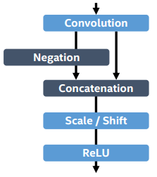
    * Inception + ResNet

* 使用新的学习率更新策略： plateau detection

     * 在 一定的iteration 以内，最小的loss没有变化过，则learning rate 就乘以一个decay

* 主要的两个blocks：
    
    * mC.Relu

    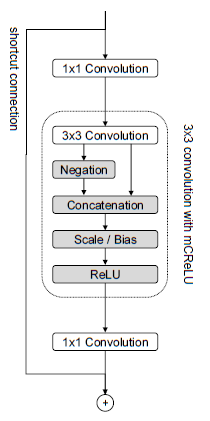 
    * Inception

    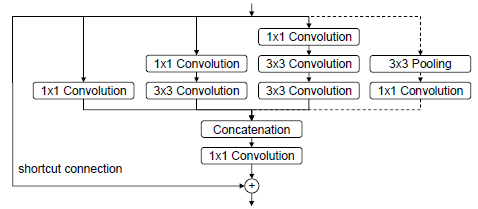

* pvanet的输入尺寸默认是 ： 1056 x 640 
* pvanet 网络架构：

    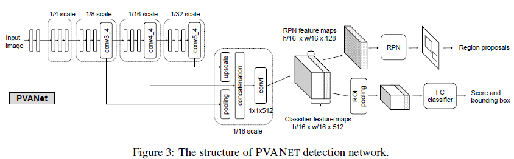
* 实验证明 RPN的输入不需要像 FC classify那样深的feature，所以pvanet采用只输入 __128__ 个channel的feature map. (通过这种方法，减少了1.4G Mac的计算量)

* pvanet的RPN采用6种尺度，7种长宽比共42种anchor来预测。最后RPN产生300个anchor。

* 用ImageNet2012 预训练模型参数：
    * 所有的图像resize 到 256， 384， 512 然后随机crop 到192 x 192

    * 初始学习率 0.1

    * when plateau ，学习率乘 1/ &radic;10 = 0.3165

    * 使用vote方法， 效果好于迭代定位。
    (Object detection via a  multi-region & semantic segmentationaware CNN model, ICCV2015)

    * FC 层 由“4096-4096” 压缩到“512-4096-512-4096”。 31.3FPS

## 7. Refine-Det（one-stage）
* 提出two-stage的三个好处：
    * 两阶段的方法采用启发式采样来控制类别不均的问题。
    * 用级联的两步对object box进行回归。
    * 用两个阶段来描述object （RPN阶段的似物性，以及具体是哪一类）

* Anchor Refine Model的作用：
    * 移除负样本的anchor来减少分类器的搜索空间。
    * 粗调定位。
* Object Detection Model的作用：
    * 细调anchor然后预测多类标签。

* 三个主要的模块：
    * Transfer Connection Block的作用：链接ARM层和ODM层，包含deconv操作和sum操作

        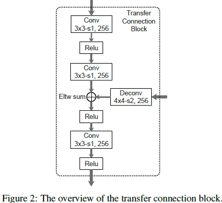
    * Two-Step 级联回归：先用ARM来粗调一个框，然后用ODM再细调。ARM的输出是 4+1 ，4是anchor坐标，1是似物性得分。ARM生成的anchor与图像的默认分格一一对应。（类似于SSD的default box）
    * 负的anchor过滤： 在训练阶段，对于refine anchor box，如果负置信度的得分大于预设的阈值（比如0.99）我们将在训练ODM的过程中抛弃它。也就是说我们只通过refine hard negative anchor和refine positive anchor 来训练ODM； 在inference阶段，如果一个refine anchor 的negative confidence大于0.99 则检测的时候抛弃。

* 训练与测试的细节：
    * 训练时的数据增强： 采用（SSD）论文的方法
    * backbone用的VGG-16和ResNet-101
    * 使用L2-norm 在conv4_3, conv5_3, 10,8上
    * Anchor的选择在空间尺度为 1/8， 1/16， 1/32， 1/64 
    * 在训练阶段，我们先匹配每一个gt和anchor最好覆盖的，然后再匹配anchor boxes和任意gt覆盖率大于0.5的

    * 选择loss比较高的negative anchor ，让negative anchor与positive anchor的比例为3：1.
    * loss: 对于ARM， 我们给每一个anchor一个二分类的标签（是不是目标）和它的4个坐标。
    * 权重初始化方法：xavier

## 8. Light-Head RCNN

* 摘要部分：
    * 二阶方法慢的原始是因为在ROI前后有很大的计算量。
    * Faster RCNN使用了2个FC来做ROI的识别； R-FCN使用了大量的score maps来表示ROIs。

    * 这篇文章把网络分成了2部分，特征提取的base部分和用来分类和产生ROI的head部分。Two-stage的方法只所以慢是因为head部分的计算量很大。
    
    * Faster RCNN 和 R-FCN都有一个共同的特点，一个重的head加上一个backbone。
        * Faster RCNN 使用2个大的FC来对ROIs区域进行识别和回归。这个是特别耗时的，尤其是当ROIs特别多的时候；此外RoI pooling产生的channel个数是特别多的，因为在Roi Pooling后面接的 _第一个FC层_ 的计算是特别大的。
        
        * R-FCN 为了共享ROI区域的计算，使用了大量的score maps，其数量是 #classes x p x p (p 是pooling的size) 
    * 这篇文章主要提出的创新点：
        * large-separable convolution to produce “thin” feature map。feature map的channel个数为&alpha; * p * p , (&alpha;&le;10)
    * 检测精度最好的two-stage： Mask-RCNN， one-stage: Retina

* 两个主要部分： R-CNN subnet 和 ROI warping
    * R-CNN subnet：
    
        1）与 __R-FCN__ 相比 feature map channel 由（#classes * p * p） 减少到 (10 * 7 * 7) 输入PSRoi pooling。
        
        2）因为改变了 channel数，所以不能通过vote来预测结果，在light-head中 采用的方式是使用一层FC来代替vote进行预测。
        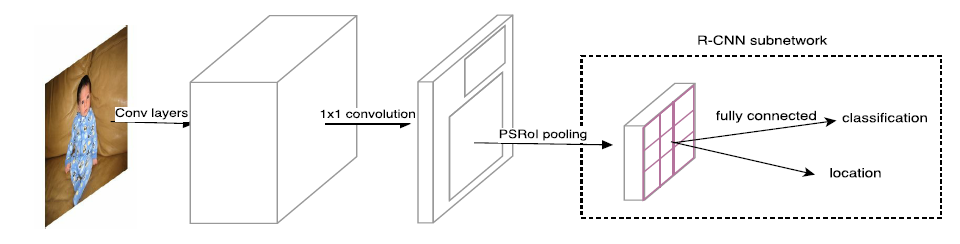
    * ROI warping：
        * 它的主要作用是保证输入到R-CNN subnet的feature map shape是固定的。
        * 同 R-FCN 一样，不使用ROI pooling 而是使用PSRoi pooling。

* 网络结构之间的比较（注意红色框中的不同）：
    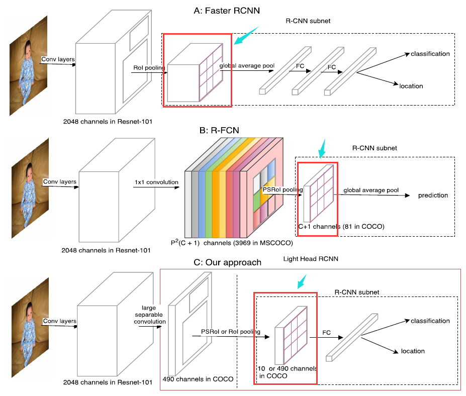

* L 网络的backbone是ResNet-101，S 网络的backbone是Xception；backbone网络后面接 __Thin feature maps__ .
* __Thin feature maps__ 是 由backbone经过large separable conv层得到的。
    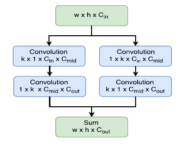
    其中， L 网络的 _k_ = 15, Cmid = 256; 而 S 网络的Cmid= 64. 并且固定Cout = 10 * p * p（而不是像R-FCN中的#classes * p * p）

* 在RPN后面接了一个NMS
* R-FCN的 下一个工作就是 [Deformable-ConvNet](https://github.com/msracver/Deformable-ConvNets)
* 改进了 PSRoi pooling， 增加了 [ROIAlign](Mask RCNN)的功能.

## 9. Mask RCNN

* 摘要：
    * 与Faster RCNN 相比，新增加了一个mask的分支。5fps，可以用于姿态评估。
    * 主要的贡献是增加了 实例分割的功能，并且提出了 __Roi Align__ .
    * mask的预测和类别预测一定要分开，也就是说 每一类都需要预测独立的mask。
    * 预测mask和预测class是并行的。
    * 其他的instance-segmentation是先分割，然后在分实例的，而这篇文章是先分实例(instance-first)然后再分割的。

* 对于Faster RCNN的分析（Speed/accuracy trade-offs for modern convolutional object detectors. In CVPR, 2017）

* 训练的loss： 每个ROI的 L = Lcls + Lbox + Lmask .

    * 其中 ： Lcls + Lbox 是 Faster RCNN 里面定义的
    *  Lmask  输出的维度是 K * m2, _K_ 是类别数，_m*m_ 是 mask的尺寸。每个像素应用sigmoid做2分类。  Lmask  定义是所有sigmoid二分类的平均loss，k类的mask至于k类的label有关，与其他label无关。这样生成的mask是与类别有关的mask，消除了mask中的类别竞争问题，这是得到好的实例分割的关键！！！

* __ROIAlign__ : 采用插值的方法获得，ROI Pooling得到的量化特征对分类没有影响，但是对pixel-wise的mask会有很大的影响。
    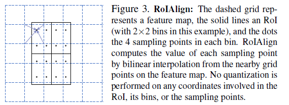

* 实验中使用的backbone是 ResNet-or-FPN
    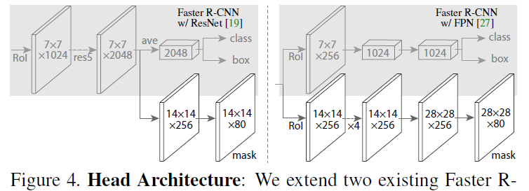

* 训练阶段：
    * 图像的短边reshape到800，一个GPU上的BS=2，N个ROI， ResNet的N=64；FPN的N=512

* 测试阶段：
    * ResNet使用300个proposal， FPN使用1000个proposal，mask分支只使用100个检测box。
    * mask分支每个Roi预测k个mask，但是只使用第k个mask，这里的k是cls预测出来的k。
    * The gains of Mask R-CNN over come from using RoIAlign (+1.1 APbb), multitask training (+0.9 APbb), and ResNeXt-101 (+1.6 APbb).

# Face 

# GANs

# Image Retrieval

# Network Architecture

# NLP

# OCR

# Recommend

# Segmentation

# Tracker